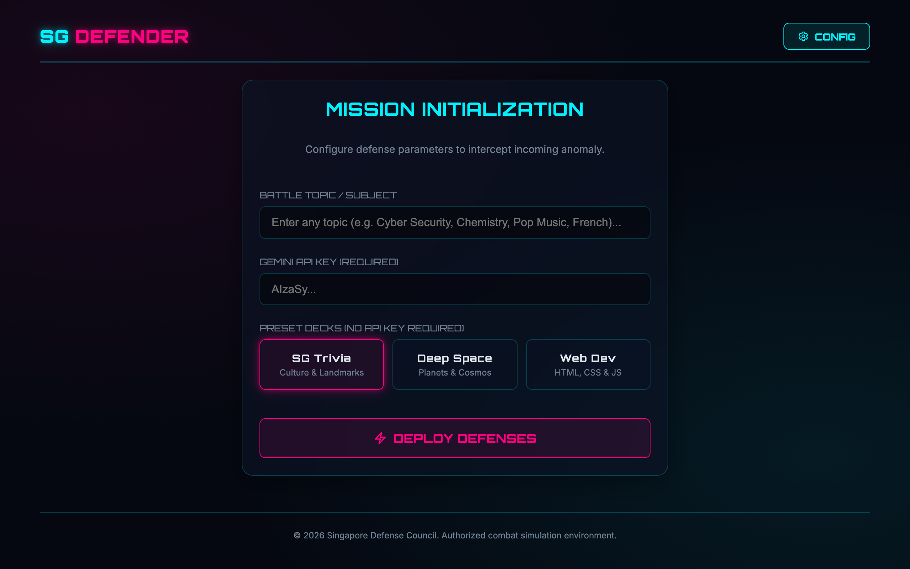

# SG Defender: Flashcard Battle Game

A cyberpunk-themed, responsive single-page web application where players defend Singapore from a giant invading monster by answering flashcard questions. Powered by Google's Gemini API for dynamic deck generation on any custom topic, with zero-setup offline presets available out of the box.



## Features

- **Custom Flashcard Generation:** Enter any topic (e.g. *Quantum Physics*, *Ancient Rome*, *Spanish Conjugations*) and your Gemini API Key directly on the setup screen to play a custom-generated deck.
- **Dynamic Combat System:** 
  - Correct answers fire a **cyan plasma laser** dealing 15 damage (or 25 critical damage for speed).
  - Incorrect answers/timeouts trigger a **monster fireball counter-attack** damaging your shields.
  - Includes floating combat text indicators (`-15 HP`) and screen shaking.
- **Polished Visuals:** Built with a neon glassmorphic HUD panel, interactive mechs/monster SVG assets, and a custom background featuring the Singapore skyline, a water-spraying Merlion, and a glowing Google Cloud logo cloud in the sky.
- **Log Feed:** Retro military-style console logging combat operations in real-time.
- **Debris Analysis (Study Guide):** Review correct answers and educational explanations for all questions at the end of the game to reinforce learning.
- **Timer Modes:** Toggleable 20s countdown timer per card for causal or intense play.

## How to Play

### 1. Run Locally
You can run this project locally using any simple HTTP server. For example, using Python:
```bash
python3 -m http.server 8000
```
Open **[http://localhost:8000/index.html](http://localhost:8000/index.html)** in your browser to start playing!

### 2. Deploy to Vercel (Zero Config)
Because this is a pure static single-page app (HTML/CSS/JS), it is extremely easy to deploy:
1. Push this repository to **GitHub**.
2. Connect your GitHub account to **[Vercel](https://vercel.com/)**.
3. Import the `build-with-gemini-2026` project and click **Deploy**. It will deploy instantly!

Alternatively, you can deploy via the Vercel CLI:
```bash
npm install -g vercel
vercel
```